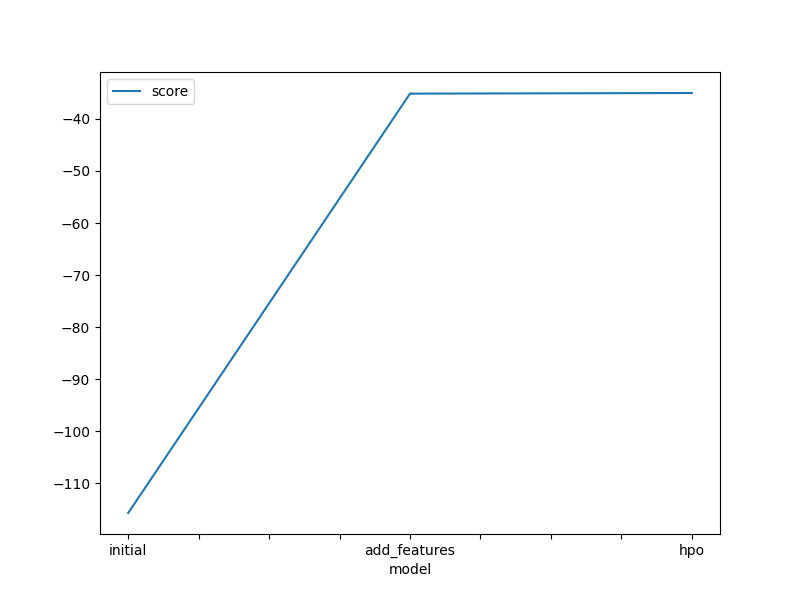
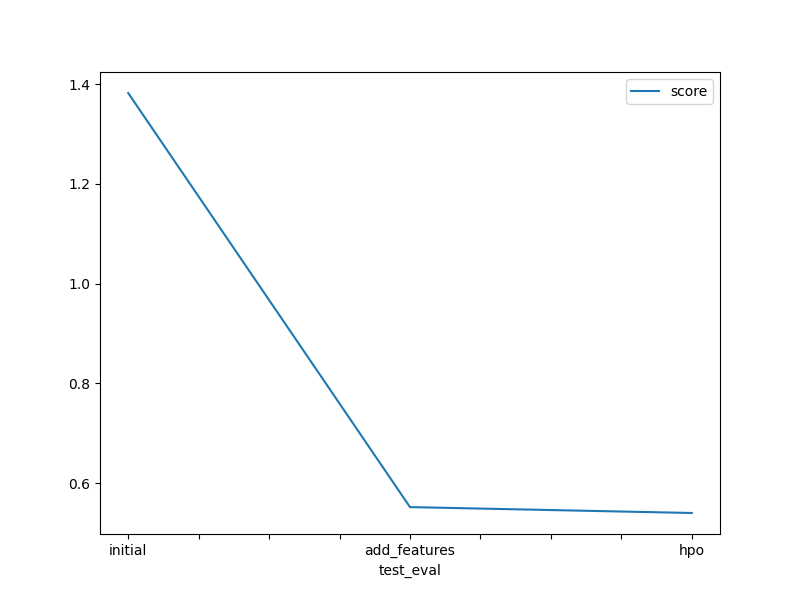

# Report: Predict Bike Sharing Demand with AutoGluon Solution
#### SOLOMON OWUSU SARFO

## Initial Training
### What did you realize when you tried to submit your predictions? What changes were needed to the output of the predictor to submit your results?
The initial submission was rejected because of the present of negative values in the predictions and that needed to be set to zero.

### What was the top ranked model that performed?
WeightedEnsemble_L2

## Exploratory data analysis and feature creation
### What did the exploratory analysis find and how did you add additional features?
The datetime columns was split further to create the following additional features; hours, days, months.

### How much better did your model preform after adding additional features and why do you think that is?
The root mean squared error reduce from -115.741 to -35.132729 with the adding the additional features.
This improvement was before the model add more correlated features to be trained on.

## Hyper parameter tuning
### How much better did your model preform after trying different hyper parameters?
There was a little reduction in root mean squared error from -35.133 to -35.01

### If you were given more time with this dataset, where do you think you would spend more time?
I will explore different hyperparameters with the LightGBM model.

### Create a table with the models you ran, the hyperparameters modified, and the kaggle score.
|model|hpo1|hpo2|hpo3|score|
|--|--|--|--|--|
|initial|default vals|default vals|default vals|1.38223|
|add_features|default vals|default vals|default vals|0.55187|
|hpo|'GBM': [{'extra_trees': True, 'ag_args': {'name_suffix': 'XT'}}, {}, 'GBMLarge',]|'RF': [{'criterion': 'squared_error', 'ag_args': {'name_suffix': 'MSE', 'problem_types': ['regression']}}|default vals|0.54004|

### Create a line plot showing the top model score for the three (or more) training runs during the project.

TODO: Replace the image below with your own.

### Create a line plot showing the top kaggle score for the three (or more) prediction submissions during the project.

TODO: Replace the image below with your own.

## Summary
I think I need to read more of the autogluon document to better improvement my scores next time.
